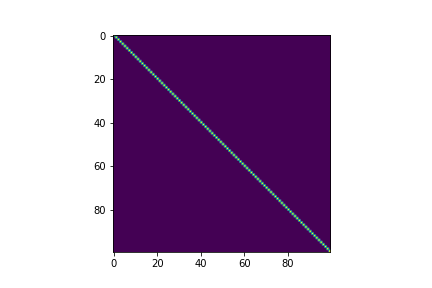
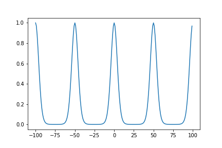
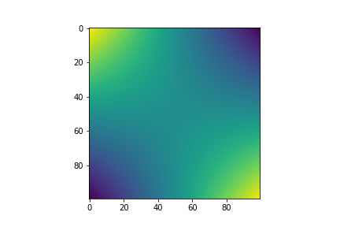

# Gaussian Processes

There are many online resources for understanding Gaussian Processes. Here's a more hands on way of introducing the topic that I found quite helpful and intuitive for myself. This post will include python code from the following packages:

```python
import math
import numpy as np
import matplotlib.pyplot as plt

np.random.seed(0)
```

We begin with a basic Gaussian distribution....it is called a Gaussian Process after all! 

$$X \sim N(\mu, \Sigma)$$

We can visualise some samples from a distribution:

```python
k = 2
mu = np.zeros(k)
covariance = np.array(
    [
        [1.0, 0.0],
        [0.0, 1.0]
    ]
)

num_samples = int(1e4)
samples = np.random.multivariate_normal(mu, covariance, num_samples)
histogram = plt.hist2d(x=samples[:, 0], y=samples[:, 1], bins=50)
```

<figure class="image" align="center">
  
</figure>

Notice how the structure of the covariance matrix can have an effect on the shape of the Gaussian:


```python
k = 2
mu = np.zeros(k)
covariance = np.array(
    [
        [1.0, 0.9],
        [0.9, 1.0]
    ]
)

num_samples = int(1e4)
samples = np.random.multivariate_normal(mu, covariance, num_samples)
histogram = plt.hist2d(x=samples[:, 0], y=samples[:, 1], bins=50)
```

<figure class="image" align="center">
  
</figure>

## Identity Covariance


For high dimensions, we can plot a single sample with the x-axis representing each dimension of the multi-variate Gaussian. At this point, this plot looks a bit nonsensical as it's just random noise.

```python
k = 100
mu = np.zeros(k)
covariance = np.eye(k)

sample = np.random.multivariate_normal(mu, covariance)
fig = plt.plot(sample.transpose())
```

<figure class="image" align="center">
  
</figure>


We can also visualize the covariance matrix:

```python
fig, ax = plt.subplots()
im = ax.imshow(covariance)
```
<figure class="image" align="center">
  
</figure>


## RBF Kernel


We can define kernel functions, which can be interpreted as a measure of distance between two points


$$\Sigma_{i, j} = \sigma^2 \exp(-\frac{|i-j|^2}{2l^2})$$

```python
def RBF(i, j, sigma, lengthscale):
    return (sigma**2)*np.exp((-(i-j)**2)/2*(lengthscale**2))
```

```python
sigma = 1
lengthscale = 0.1
x = np.arange(-100, 100)
fig = plt.plot(x, [RBF(0, i, sigma, lengthscale) for i in (x)])
```

<figure class="image" align="center">
  
</figure>


### RBF Covariance


Using the kernel function to compute each element in the covariance matrix, we can generate a multi-variate Gaussian which can have desireable properties, such as smooth curves in this case. Just by changing the structure of the covariance matrix, our samples already look more interesting.

```python
k = 40

sigma = 1
lengthscale = 0.1

mu = np.zeros(k)
covariance = np.zeros((k, k))

for i in range(covariance.shape[0]):
    for j in range(covariance.shape[1]):
        covariance[i, j] = RBF(i, j, sigma, lengthscale)
```

```python
samples = np.random.multivariate_normal(mu, covariance, 10)
fig = plt.plot(samples.transpose())
```

<figure class="image" align="center">
  
</figure>


Visualizing the covariance matrix, we can see that dimensions that are "closer" to each other have higher covariance, which is the cause of the smootheness of the curves above.

```python
fig, ax = plt.subplots()
im = ax.imshow(covariance)
```

<figure class="image" align="center">
  
</figure>


## Periodic Kernel


Simiarly, we can define a periodic kernel:


$$\Sigma_{i, j} = \sigma^2 \exp(-\frac{2\sin^2(\pi|i-j|/p)}{l^2})$$

```python
def period(i, j, sigma, lengthscale, periodicity):
    return (sigma**2)*np.exp(-(2*(np.sin((math.pi*np.abs(i-j))/periodicity)**2)/(lengthscale**2)))
```

```python
sigma = 1
lengthscale = 0.5
periodicity = 50
x = np.arange(-100, 100)
fig = plt.plot(x, [period(0, i, sigma, lengthscale, periodicity) for i in (x)])
```

<figure class="image" align="center">
  
</figure>


### Periodic Covariance


This allows us to define a function space from which we can sample periodic curves

```python
k = 40

sigma = 0.2
lengthscale = 1
periodicity = 10

mu = np.zeros(k)
covariance = np.zeros((k, k))
for i in range(covariance.shape[0]):
    for j in range(covariance.shape[1]):
        covariance[i, j] = period(i, j, sigma, lengthscale, periodicity)
        
samples = np.random.multivariate_normal(mu, covariance, 2)
fig = plt.plot(samples.transpose())
```

<figure class="image" align="center">
  
</figure>


The structure of the covariance matrix also shows us how we are able to sample such curves. The periodicity is embedded into the covariance relationship

```python
fig, ax = plt.subplots()
im = ax.imshow(covariance)
```

<figure class="image" align="center">
  
</figure>


## Linear Kernel


Again, we can do the same for linear functions:


$$\Sigma_{i, j} = \sigma_b^2 + \sigma^2(i-c)(j-c)$$

```python
def linear(i, j, sigma, sigma_b, offset):
    return sigma_b**2+(sigma**2)*(i-offset)*(j-offset)
```

### Periodic Covariance

```python
k = 100

sigma = 2
sigma_b = 0.8
offset = 0

mu = np.zeros(k)
covariance = np.zeros((k, k))
for i in range(covariance.shape[0]):
    for j in range(covariance.shape[1]):
        covariance[i, j] = linear(i-int(k/2), j-int(k/2), sigma, sigma_b, offset)
        
num_samples = 10
samples = np.random.multivariate_normal(mu, covariance, 10)
fig = plt.plot(samples.transpose())
```

<figure class="image" align="center">
  
</figure>


```python
fig, ax = plt.subplots()
im = ax.imshow(covariance)
```

<figure class="image" align="center">
  
</figure>


## Combining Kernels


We can easily combine kernels or "function spaces" by linearly combining them when defining the covariance matrix. Here we use both the linear kernel and periodic kernel to define a function space of curves that are linear with periodic elements.

```python
k = 100
linear_sigma = 0.1
linear_sigma_b = 0.3
linear_offset = 0

period_sigma = 1
period_lengthscale = 0.5
period_periodicity = 20

mu = np.zeros(k)
covariance = np.zeros((k, k))
for i in range(covariance.shape[0]):
    for j in range(covariance.shape[1]):
        covariance[i, j] += linear(i-int(k/2), j-int(k/2), linear_sigma, linear_sigma_b, linear_offset)
        
for i in range(covariance.shape[0]):
    for j in range(covariance.shape[1]):
        covariance[i, j] += period(i, j, period_sigma, period_lengthscale, period_periodicity)
        
samples = np.random.multivariate_normal(mu, covariance, 3)
fig = plt.plot(samples.transpose())
```

<figure class="image" align="center">
  
</figure>


Visualizing the covariance matrix, you can see that it looks as if the linear and periodic covariance matricies from before are overlayed ontop of each other.

```python
fig, ax = plt.subplots()
im = ax.imshow(covariance)
```

<figure class="image" align="center">
  
</figure>

## Conditioning


Because up until now, we've essentially only been working with high dimensional Gaussian distributions, we can "train" them by conditioning them on existing data. This collapses the distribution and can provide meaningful predictions for extrapolation and interpolation purposes. We can use the formula for conditioning multi-variate Gaussians:


$$X|Y \sim N(\mu_X+\Sigma_{XY}\Sigma_{YY}^{-1}(Y-\mu_Y), \Sigma_{XX}-\Sigma_{XY}\Sigma_{YY}^{-1}\Sigma_{YX})$$

```python
def condition(kernel_func, kernel_params, X, Y, X_test):
    sig_xx = np.zeros((X_test.shape[0], X_test.shape[0]))
    for i in range(X_test.shape[0]):
        for j in range(X_test.shape[0]):
            sig_xx[i, j] += kernel_func(X_test[i], X_test[j], **kernel_params)
            
    sig_xy = np.zeros((X_test.shape[0], Y.shape[0]))
    for i in range(X_test.shape[0]):
        for j in range(X.shape[0]):
            sig_xy[i, j] += kernel_func(X_test[i], X[j], **kernel_params)
            
    sig_yx = np.zeros((Y.shape[0], X_test.shape[0]))
    for i in range(X.shape[0]):
        for j in range(X_test.shape[0]):
            sig_yx[i, j] += kernel_func(X[i], X_test[j], **kernel_params)
            
    sig_yy = np.zeros((Y.shape[0], Y.shape[0]))
    for i in range(X.shape[0]):
        for j in range(X.shape[0]):
            sig_yy[i, j] += kernel_func(X[i], X[j], **kernel_params)

    mu = np.matmul(np.matmul(sig_xy, np.linalg.inv(sig_yy)), Y)
    covariance = sig_xx-np.matmul(np.matmul(sig_xy, np.linalg.inv(sig_yy)), sig_yx)
    return mu.reshape(-1), covariance
```

```python
kernel_func = RBF
kernel_params = {
    'sigma': 2,
    'lengthscale': 0.2,
}

X = np.array(
    [
        [0, 1, 5, 20, 21]
    ]
).transpose()
Y = np.array(
    [
        [0, 1, 0.5, 0, 1]
    ]
).transpose()

X_test = np.arange(50).reshape(-1, 1)

mu, covariance = condition(
    kernel_func, 
    kernel_params,
    X,
    Y, 
    X_test,
)
samples = np.random.multivariate_normal(mu, covariance, 5)
fig = plt.plot(np.repeat(X_test, 5, axis=1), samples.transpose())
fig = plt.scatter(X, Y)

```

<figure class="image" align="center">
  
</figure>


Providing a few data points to condition on, we can see that when sampling from the new posterior distribution, the curves will always pass through the given data points. This conditioning process essentially "trains" the model to take known data into account when making predictions. Hyperparameter tuning is also employed to further fine tune the model to accurately represent the behaviour of the signal and optimize the uncertainty surrounding unknown data points.
