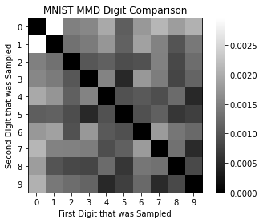
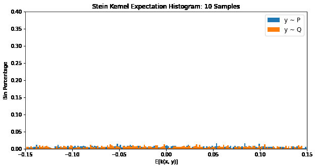
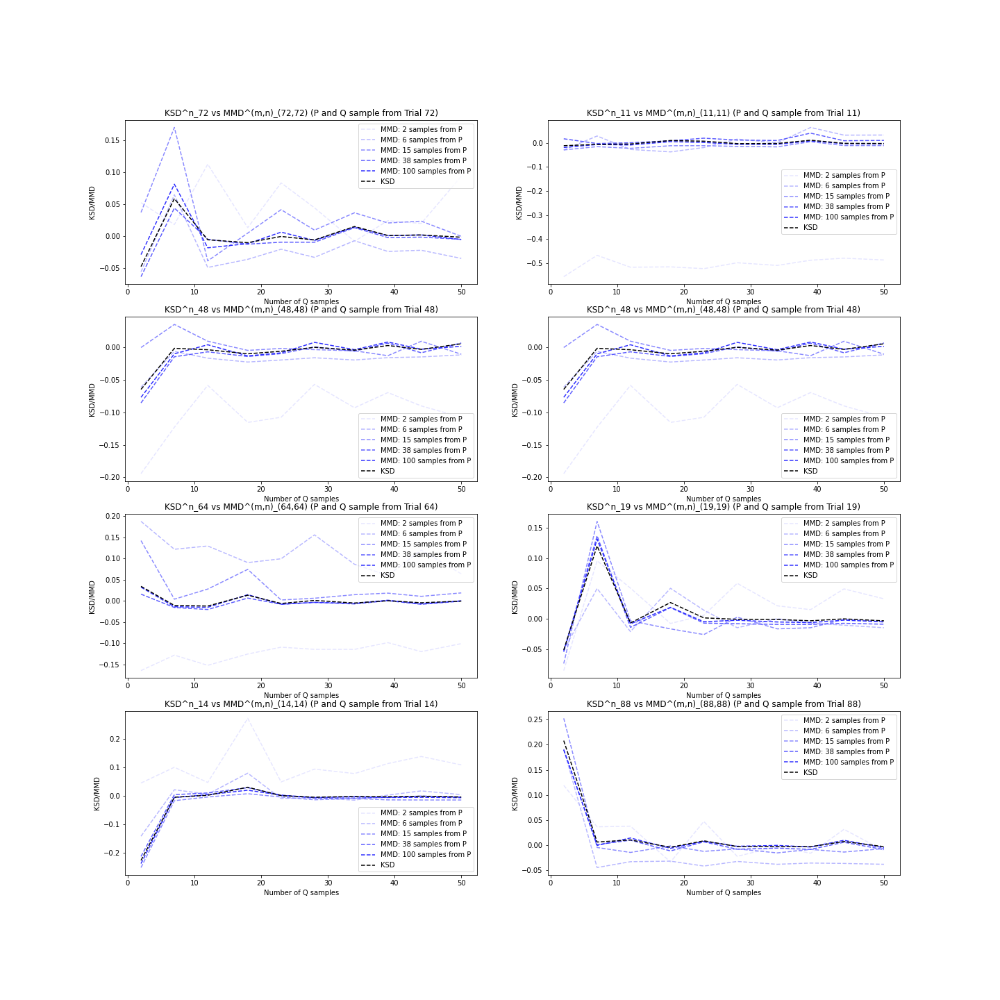
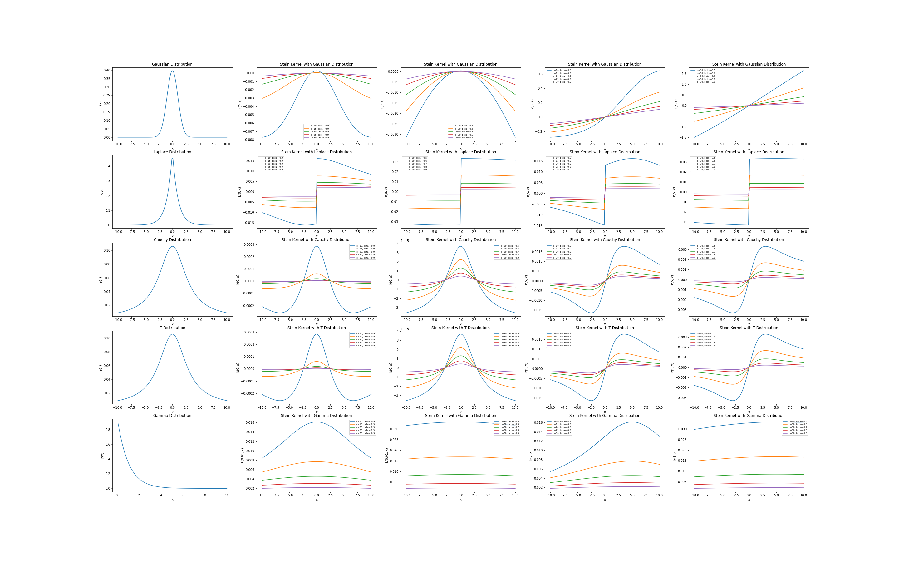
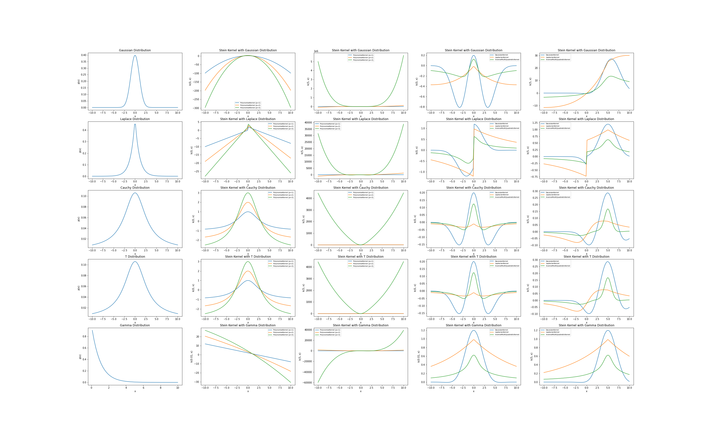

# The Kernel Stein Discrepancy

## Why Distribution Discrepancies?

<!-- Having worked at Revolut as a machine learning engineer, there was access to swaths of data. For millions of users worldwide, there was data (anonymised ofcourse) on their daily spending, trading behaviours, travel tendancies, and even the details of their app usage. But this vast amount of data can be overwhelming. Ofcourse we observed general trends that could inform the business, but to *really* model terabytes of data, you'd run into one problem very quickly: *intractability*. You will quickly find that modelling such a complex and large dataset just can't scale.

Approximate inference is a common method of getting around this problem. As the name suggests, instead calculating the *exact* data distribution, we perform inference on an *approximation* of our data. To quantify our apporximation, we need a distribution discrepancy. In its most general form we can denote this as $$D(\mathbb{P}||\mathbb{Q})$$, the discrepancy between two distributions $$\mathbb{P}$$ and $$\mathbb{Q}$$. 

In particular, I'll be introducing the Kernel Stein Discrepancy (KSD). As background, we'll first review one class of distribution discrepancies, the integral probability metric (IPM) and an instance IPMs known as the maximum mean discrepancy (MMD). -->

## Integral Probability Metrics (IPMs): A Quick Review

The IPM is defined as:

$$IPM = \sup_{f\in F} \{ \mathbb{E}_{x \sim \mathbb{P}}[f(x)] - \mathbb{E}_{y \sim \mathbb{Q}}[f(y)] \}$$

The IPM is a comparison of two densities after they are mapped to a new function space. This new space is defined by the mapping $$f$$. The role of $$f$$ is to expose the differences in density between $$\mathbb{P}$$ and $$\mathbb{Q}$$. For example, if we trivially chose $$f(x) = 0$$, then $$\mathbb{E}_{x \sim \mathbb{P}}[f(x)] - \mathbb{E}_{y \sim \mathbb{Q}}[f(y)]$$ would always be zero, which isn't very helpful for our comparison. So to reveal any and all differences between $$\mathbb{P}$$ and $$\mathbb{Q}$$, we need $$f^*$$, the mapping that *maximises* the discrepancy, $$\mathbb{E}_{x \sim \mathbb{P}}[f(x)] - \mathbb{E}_{y \sim \mathbb{Q}}[f(y)]$$. This is the purpose of $$\sup_{f\in F}$$, the supremum operator.

This $$f^*$$ is called the witness function. We can visualise a possible witness function when $$\mathbb{P}$$ is Gaussian and $$\mathbb{Q}$$ follows a Laplace distribution:

<figure class="image" align="center">
  
  <figcaption>A possible witness function comparing a Gaussian and Laplace Distribution</figcaption>
</figure>

Notice that when $$f(x)=0$$,  $$p(x) = q(x)$$. Moreover, when $$p(x) > q(x)$$, $$f(x) > 0$$ and the same vice versa. This increases the quantity $$\mathbb{E}_{x \sim \mathbb{P}}[f(x)] - \mathbb{E}_{y \sim \mathbb{Q}}[f(y)]$$ and ensures that the IPM is non-zero, indicating that $$\mathbb{P} \neq \mathbb{Q}$$ as expected.

## Maximum Mean Discrepancy (MMD): A Quick Review

The supremum in the IPM is over $$F$$, the space of *all* possible functions. This can be impractical to evaluate and we often limit our function space to the unit ball of an RKHS. This restriction on the IPM constructs the Maximum Mean Discrepancy (MMD):

$$MMD = \sup_{||f||_{RKHS} \leq 1 } \{ \mathbb{E}_{x \sim \mathbb{P}}[f(x)] - \mathbb{E}_{y \sim \mathbb{Q}}[f(y)] \}$$

where $$RKHS$$ is our reproducing kernel Hilbert space. To ensure $$MMD = 0 \Leftrightarrow \mathbb{P} = \mathbb{Q}$$, the kernel must be *characteristic*. This means that the kernel uniquely maps our density function into the RKHS. Characterstic kernels often involve an exponential function, such as the Gaussian Kernel, $$k(x, y) = \exp(-\sigma\|x-y\|_2^2)$$. This is because the exponential acts as a fourier transform on the probability distribution. The uniqueness property is acheived by incorporating all moments of the distribution into the mapping. Witness functions that are able to discriminate pointwise between samples of $$\mathbb{P}$$ and $$\mathbb{Q}$$ also need to be avoided (i.e. a function with a positive impulse at each $$\mathbb{P}$$ sample and a negative impulse at each $$\mathbb{Q}$$ sample). The unit ball restriction $$\|f\| \leq 1$$, applies a decay on higher frequencies, ensuring the smoothness of $$f$$.

Given $$k(\cdot, \cdot)$$, the reproducing kernel associated with our RKHS, it can be shown that:

$$MMD^2 =  \mathbb{E}_{X, \tilde{X} \sim \mathbb{P}}[k(X,\tilde{X})]-2\mathbb{E}_{X \sim \mathbb{P},Y \sim \mathbb{Q}}[k(X,Y)]+\mathbb{E}_{Y, \tilde{Y} \sim \mathbb{Q}}[k(Y,\tilde{Y})]$$ 

see <a href="https://www.revolut.com">here</a> for a derivation. Usually the RKHS is defined from our choice of reproducing kernel.

An unbiased estimate of the MMD:

$$\hat{MMD}^2 = \frac{1}{m(m-1)}\sum_{i=1}^{m}\sum_{j\neq i}^{m}k(x_i, x_j)+\frac{1}{n(n-1)}\sum_{i=1}^{n}\sum_{j\neq i}^{n}k(y_i, y_j)-\frac{2}{mn}\sum_{i=1}^{m}\sum_{j=1}^{n}k(x_i, y_j)$$

### MNIST Example

The MMD only requires $$\mathbb{P}$$ and $$\mathbb{Q}$$ samples, making no assumptions about their underlying distributions. This is useful when we don't have strong intuitions about the data generating process. An example is the MNIST dataset, where we can quantify the discrepancy between digits directly from the image samples. A heatmap of the MMDs:

<figure class="image" align="center">
  
  <figcaption>MNIST MMD Digit Comparison</figcaption>
</figure>

Samples from the same digit have lower MMDs (the diagonal) and we have higher MMDs for digits that are not as similar, such as zero and one. More similar digits like seven and nine have lower MMDs.

### Kernel Selection

The kernel defines the RKHS from which we acquire our witness function. If a poor kernel is chosen, the corresponding RKHS might provide a poor function space for discriminating $$\mathbb{P}$$ and $$\mathbb{Q}$$. We can visualise how  the kernel function affects our MNIST heatmap:

## Kernel Stein Discrepancies (KSD)

The MNIST example showed that when $$\mathbb{P}$$ and $$\mathbb{Q}$$ are unknown, the MMD is very effective. However, we often have samples from an unknown $$\mathbb{Q}$$ that we want to compare to a known $$\mathbb{P}$$. In this case, the MMD would have us sampling both $$\mathbb{P}$$ and $$\mathbb{Q}$$, a pretty inefficient approach. The Kernel Stein Discrepancy (KSD) solves this problem by incorporating the density function of $$\mathbb{P}$$ into the discrepancy calculation. The KSD quantifies the descrepancy between a known density $$\mathbb{P}$$ and an unknown density $$\mathbb{Q}$$ that we can sample.

### The Stein Identity

Suppose we want a find an operator $$\mathcal{A_\mathbb{P}}$$ such that:

$$\mathbb{E}_{x \sim \mathbb{P}}([(\mathcal{A}f)(X)] = 0,  \forall f \Leftrightarrow X \sim \mathbb{P}$$ 

This is known as the Stein identity. Any operator $$\mathcal{A}$$ that satisfies the Stein identity is called a Stein operator. The existence of $$\mathcal{A}$$ would be a powerful tool. $$\mathcal{A}$$ would define a Hilbert space where $$\mathbb{P}$$ density always maps to zero. An unknown distribution $$\mathbb{Q}$$ would only map to zero if $$\mathbb{P} = \mathbb{Q}$$.

For the MMD, $$f$$ mapped our densities to an RKHS uniquely defined by our choice of kernel $$k(\cdot, \cdot)$$. $$\mathcal{A}$$ represents a modification of $$f$$ to ensure that the Stein identity is satisifed. Modifying our MMD with $$\mathcal{A_\mathbb{P}}$$:

$$\sup_{\|f\|_{RKHS} \leq 1 } \{ \mathbb{E}_{x \sim \mathbb{P}}[(\mathcal{A}f)(x)] - \mathbb{E}_{y \sim \mathbb{Q}}[(\mathcal{A}f)(y)] \}$$

Notice that if we're able to find some $$\mathcal{A}$$ satisfying the Stein identity, the term $$\mathbb{E}_{x \sim \mathbb{P}}[(\mathcal{A_\mathbb{P}}f)(x)]$$ is zero, from our Stein identity, leaving us with a single expectation over $$\mathbb{Q}$$. This is the Stein discrepancy:

$$SD = \sup_{\|f\|_{RKHS} \leq 1 } \{\mathbb{E}_{y \sim \mathbb{Q}}[(\mathcal{A}f)(y)] \}$$

Unlike the MMD, the Stein discrepancy has a single estimator over samples from $$\mathbb{Q}$$. But how is $$\mathbb{P}$$ involved? Surely a discrepancy between $$\mathbb{P}$$ and $$\mathbb{Q}$$ should also include information about $$\mathbb{P}$$! 

### Stein Operators

Given that our mapping $$f$$ was unchanged from our MMD, the density $$\mathbb{P}$$ must be incorporated in our Stein operator $$\mathcal{A}$$. Understanding Stein operators that satisfy the Stein equation remains an open problem, but there have been many formulations of $$\mathcal{A}$$. One formulation is the Langevin Stein operator: 

$$(\mathcal{A}f)(x) := \langle \nabla_x \log p(x), f(x) \rangle + \nabla_x f(x)$$

where $$p(x)$$ is the density function of $$\mathbb{P}$$. This is often known as *the* Stein operator in machine learning. As we expected, $$\mathbb{P}$$ is still present in our Stein discrepancy with the density function embedded into our Stein operator. We will denote the Stein operator $$\mathcal{A_{\mathbb{P}}}$$ to indicate this explicitly: 

$$SD = \sup_{\|f\|_{RKHS} \leq 1 } \{\mathbb{E}_{y \sim \mathbb{Q}}[(\mathcal{A_{\mathbb{P}}}f)(y)] \}$$

Now that we have concrete examples of Stein operators, let's discuss how to computationally apply $$(\mathcal{A_{\mathbb{P}}}f)$$ to our $$\mathbb{Q}$$ samples.

### Stein Kernels

We know that kernel are defined:

$$k(x, y) = \langle f(x), f(y)\rangle$$

Applying our Stein operator to $$f$$ we can derive a corresponding Stein kernel:

$$k_{\mathbb{P}}(x, y) = \langle (\mathcal{A}_\mathbb{P} f)(x), (\mathcal{A}_\mathbb{P} f)(y)\rangle$$

From linearity:

$$k_{\mathbb{P}}(x, y) = \mathcal{A}_\mathbb{P}^y \mathcal{A}_\mathbb{P}^x \langle f(x),f(y)\rangle$$

$$k_{\mathbb{P}}(x, y) = \mathcal{A}_\mathbb{P}^y \mathcal{A}_\mathbb{P}^x k(x, y)$$

where $$\mathcal{A}_\mathbb{P}^x$$ indicates $$\mathcal{A}_\mathbb{P}$$ applied on $$x$$.

Applying $$\mathcal{A}_\mathbb{P}^x$$:

$$k_{\mathbb{P}}(x, y) = \mathcal{A}_\mathbb{P}^y (\nabla_x \log p(x)^T k(x, y) + \nabla_x k(x, y))$$

Note that $$\nabla_x k(x, y) = \langle \nabla_x f(x), f(y) \rangle$$:

$$k_{\mathbb{P}}(x, y) = \mathcal{A}_\mathbb{P}^y (\nabla_x \log p(x)^T k(x, y) + \langle \nabla_x f(x), f(y) \rangle)$$

Applying $$\mathcal{A}_\mathbb{P}^y$$:

$$k_{\mathbb{P}}(x, y) = \nabla_y \log p(y)^T(\nabla_x \log p(x)^T k(x, y) + \nabla_x k(x, y)) + \nabla_y ( \nabla_x \log p(x)^T k(x, y) + \langle \nabla_x f(x), f(y) \rangle)$$

$$k_{\mathbb{P}}(x, y) = \nabla_y \log p(y)^T\nabla_x \log p(x)^T k(x, y) + \nabla_y \log p(y)^T\nabla_x k(x, y) + \nabla_x \log p(x)^T \nabla_y k(x, y) +  \langle \nabla_x f(x), \nabla_y f(y)\rangle$$

We can rewrite $$\langle \nabla_x f(x), \nabla_y f(y)\rangle = \sum_i \frac{\partial k(x,y)}{\partial x_i \partial y_i} = Tr(\nabla_x \nabla_y k(x,y))$$. 

Thus the Stein Kernel is:

$$k_{\mathbb{P}}(x, y) = \nabla_y \log p(y)^T\nabla_x \log p(x)^T k(x, y) + \nabla_y \log p(y)^T\nabla_x k(x, y) + \nabla_x \log p(x)^T \nabla_y k(x, y) +  Tr(\nabla_x \nabla_y k(x,y))$$

It is a modification of a base kernel $$k$$ with $$p(x)$$, the density function of $$\mathbb{P}$$.

### Numerical Convergence

We can modify our Stein identity with our Stein Kernel:

$$\mathbb{E}_{X \sim \mathbb{P}}[k_{\mathbb{P}}(x, X)] = 0 \Leftrightarrow X \sim \mathbb{P}$$

where $$x \in \mathbb{R}^d$$.

We can numerically verify the Stein identity by plotting the distribution of expectations of samples of $$k_{\mathbb{P}}(X, x)$$. The below plot compares $$Y \sim \mathbb{P}$$ and $$Y \sim \mathbb{Q}$$, where $$\mathbb{Q}$$ is a Laplace distribution. For $$\mathbb{P}$$, the distribution centers around zero, while the distribution for $$\mathbb{Q}$$ has a non-zero mean. Moreover, the effect of the law of large numbers shows how the histograms narrow as the sample size increases. 

<figure class="image" align="center">
  
  <figcaption>Stein Kernels for different base kernels</figcaption>
</figure>

### The Kernel Stein Discrepancy

We have essentially arrived at the KSD formulation. Formally, it is defined:

$$KSD^2 = \mathbb{E}_{X, \tilde{X} \sim \mathbb{Q}}[k_{\mathbb{P}}(X, \tilde{X})]$$

where $$k_{\mathbb{P}}$$ is the Stein kernel.

### MMD -> KSD 

We derived the KSD from the MMD formulation, cancelling terms using the Stein identity. We can in some ways view the KSD is an instance of the MMD using a Stein kernel. If we computed the MMD with a Stein kernel, we can see its convergence to the KSD via the law of large numbers (i.e. $$\mathbb{E}_{X \sim \mathbb{P}}[k_{\mathbb{P}}(X, \tilde{X})] \rightarrow 0$$ and $$\mathbb{E}_{X \sim \mathbb{P}, Y \sim \mathbb{Q}}[k_{\mathbb{P}}(X, Y)] \rightarrow 0$$).

<figure class="image" align="center">
  
  <figcaption> </figcaption>
</figure>

### Visualising Stein Kernels

We can visualise the kernel with respect to its different parameters:

<figure class="image" align="center">
  
  <figcaption>Stein Kernels for different base distributions</figcaption>
</figure>

We can also visually compare the Stein Kernels across different seed kernels.

<figure class="image" align="center">
  
  <figcaption>Stein Kernels for different base kernels</figcaption>
</figure>

# Applications of the KSD

- check quality of sampling algos
  - mcmc convergence diagnosis
  - importance sampling -> instead of sampling a complex dist P, sample from Q, a simpler dist, and weight samples accordingly
- minimum distance applications
- density estimation
- bayesian inference
- hypothesis testing

# Limitations of the KSD

multimodal

## Appendix 
### MMD Derivation

Starting with the IPM definition:

$$IMP = \sup_{f\in F} \{ \int f(x) d \mathbb{P}(x)-\int f(y) d \mathbb{Q}(y) \}$$

For the MMD we choose $$F:= \{||f||_H \leq 1 \}$$:

$$MMD^2 = \left[ \sup_{||f||\leq 1} \{ \int f(x) d \mathbb{P}(x)-\int f(y) d \mathbb{Q}(y) \} \right]^2$$

Given that $$\mathbb{E}_{x \sim \mathbb{P}}[f(x)] = \langle f, \mu_{\mathbb{P}}\rangle_H$$ and $$\mathbb{E}_{x \sim \mathbb{P}}[f(x)] := \int f(x)d\mathbb{P}(x)$$, we can substitute:

$$MMD^2 = \left[ \sup_{||f||\leq 1} \{ \langle f, \mu_{\mathbb{P}}\rangle_H-\langle f, \mu_{\mathbb{Q}}\rangle_H \} \right]^2$$

and by linearity,

$$MMD^2 = \left[ \sup_{||f||\leq 1} \{ \langle f, \mu_{\mathbb{P}}-\mu_{\mathbb{Q}}\rangle_H \} \right]^2$$

Claim:

$$\sup\{\langle v, w\rangle: w \in V, ||w|| \leq 1\} = \sup\{\langle v, w\rangle: w \in V, ||w|| = 1\}$$

Consider $$w' = \alpha w$$ where $$||w||=1$$ and $$0 \leq \alpha \leq 1$$:

Then $$||w'|| \leq 1$$ and 

$$\langle v, w'\rangle = \langle v, \alpha w\rangle = \alpha \langle v, w\rangle \leq \langle v, w\rangle$$

Thus $$\langle v, w\rangle$$ for $$||w|| \leq 1$$ is maximised when $$||w||=1$$ and the supremum of $$\langle v, w\rangle$$ for $$||w|| \leq 1$$ will always have $$||w|| = 1$$.

Back to our MMD derivation, with the result above, we can replace $$||f|| \leq 1$$ with $$||f||=1$$:

$$MMD^2 = \left[ \sup_{||f||= 1} \{ \langle f, \mu_{\mathbb{P}}-\mu_{\mathbb{Q}}\rangle_H \} \right]^2$$

We can also prove that $$||v|| = \sup_{||w||=1} \{ \langle v, w\rangle \}$$:

($$\leq$$):

Let $$w' := \frac{v}{||v||}$$ and knowing $$||v|| = \sqrt{\langle v, w\rangle}$$:

$$||v||^2 = \langle v, v\rangle = ||v||\langle v, \frac{v}{||v||}\rangle = ||v||\langle v, w'\rangle$$

Moreover,

$$|v||^2 \leq ||v|| \sup \{\langle v, w\rangle : w \in V, ||w||=1\}$$

Thus,

$$||v||^2 \leq \sup \{\langle v, w\rangle : w \in V, ||w||=1\}$$

($$\geq$$):

From the Cauchy-Schqarz inequality:

$$\left\| v \right\| \left\| w \right\| \geq |\langle v, w\rangle|$$

Given that $$\|w\|=1$$:

$$||v|| \geq |\langle v, w\rangle|$$

Thus,

$$||v||^2 \geq \sup \{\langle v, w\rangle : w \in V, ||w||=1\}$$

Combining the above:

$$||v||^2 = \sup \{\langle v, w\rangle : w \in V, ||w||=1\}$$

Using this result for our MMD expression:

$$MMD^2 = ||\mu_{\mathbb{P}}-\mu_{\mathbb{Q}}||^2_H$$

Expanding,

$$MMD^2 = \langle \mu_{\mathbb{P}}-\mu_{\mathbb{Q}}, \mu_{\mathbb{P}}-\mu_{\mathbb{Q}}\rangle = \langle \mu_{\mathbb{P}}, \mu_{\mathbb{P}}\rangle - 2\operatorname{Re}(\langle \mu_{\mathbb{P}}, \mu_{\mathbb{Q}}\rangle) + \langle \mu_{\mathbb{Q}}, \mu_{\mathbb{Q}}\rangle$$

Simplifying,

$$MMD^2 = ||\mu_{\mathbb{P}}||^2 - 2|\langle \mu_{\mathbb{P}}, \mu_{\mathbb{Q}} \rangle|_H + ||\mu_{\mathbb{Q}}||^2_H$$

Knowing that $$\|\mu_{\mathbb{P}}\|^2_H = \langle \mathbb{E}[k(\cdot, X)], \mathbb{E}[k(\cdot, \tilde{X})]\rangle = \mathbb{E}[k(X, \tilde{X})]$$ and $$\langle \mu_{\mathbb{P}}, \mu_{\mathbb{P}} \rangle_H = \langle\mathbb{E}[k(\cdot, X)], \mathbb{E}[k(\cdot, Y)]\rangle = \mathbb{E}[k(X, Y)]$$, we can substitute and achieve our desired result:

$$MMD^2 =  \mathbb{E}_{X, \tilde{X} \sim \mathbb{P}}[k(X,\tilde{X})]-2\mathbb{E}_{X \sim \mathbb{P},Y \sim \mathbb{Q}}[k(X,Y)]+\mathbb{E}_{Y, \tilde{Y} \sim \mathbb{Q}}[k(Y,\tilde{Y})]$$