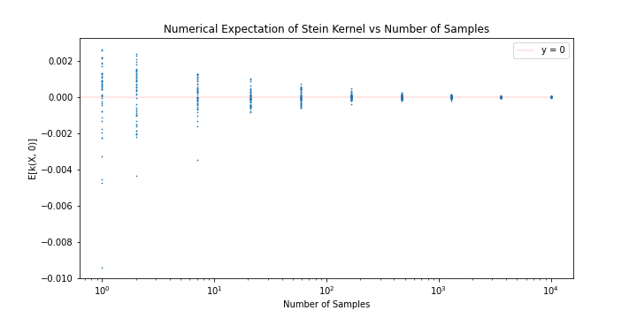

# The Kernel Stein Discrepancy

## Why Distribution Discrepancies?

<!-- Having worked at Revolut as a machine learning engineer, there was access to swaths of data. For millions of users worldwide, there was data (anonymised ofcourse) on their daily spending, trading behaviours, travel tendancies, and even the details of their app usage. But this vast amount of data can be overwhelming. Ofcourse we observed general trends that could inform the business, but to *really* model terabytes of data, you'd run into one problem very quickly: *intractability*. You will quickly find that modelling such a complex and large dataset just can't scale.

Approximate inference is a common method of getting around this problem. As the name suggests, instead calculating the *exact* data distribution, we perform inference on an *approximation* of our data. To quantify our apporximation, we need a distribution discrepancy. In its most general form we can denote this as $$D(\mathbb{P}||\mathbb{Q})$$, the discrepancy between two distributions $$\mathbb{P}$$ and $$\mathbb{Q}$$. 

In particular, I'll be introducing the Kernel Stein Discrepancy (KSD). As background, we'll first review one class of distribution discrepancies, the integral probability metric (IPM) and an instance IPMs known as the maximum mean discrepancy (MMD). -->

## Integral Probability Metrics (IPMs): A Review

The IPM is defined as:

$$IPM = \sup_{f\in F} \{ \mathbb{E}_{x \sim \mathbb{P}}[f(x)] - \mathbb{E}_{y \sim \mathbb{Q}}[f(y)] \}$$

The IPM is a comparison of two densities after they are mapped to new function space. This new space is defined by the mapping $$f$$. The role of $$f$$ is to expose the differences in density between $$\mathbb{P}$$ and $$\mathbb{Q}$$. For example, if we chose $$f(x) = 0$$, then $$\mathbb{E}_{x \sim \mathbb{P}}[f(x)] - \mathbb{E}_{y \sim \mathbb{Q}}[f(y)]$$ would always be zero, which isn't very helpful for our comparison. So to reveal any and all differences between $$\mathbb{P}$$ and $$\mathbb{Q}$$, we need $$f^*$$, the mapping that *maximises* the discrepancy, $$\mathbb{E}_{x \sim \mathbb{P}}[f(x)] - \mathbb{E}_{y \sim \mathbb{Q}}[f(y)]$$. This is the purpose of $$\sup_{f\in F}$$, the supremum operator.

This $$f^*$$ is called the witness function. We can visualise a possible witness function when $$\mathbb{P}$$ is Gaussian and $$\mathbb{Q}$$ follows a Laplace distribution:

<figure class="image" align="center">
  
  <figcaption>A possible witness function comparing a Gaussian and Laplace Distribution</figcaption>
</figure>

Notice that when $$f(x)=0$$,  $$p(x) = q(x)$$. Moreover, when $$p(x) > q(x)$$, $$f(x) > 0$$ and the same vice versa. This increases the quantity $$\mathbb{E}_{x \sim \mathbb{P}}[f(x)] - \mathbb{E}_{y \sim \mathbb{Q}}[f(y)]$$ and ensures that the IPM is non-zero, indicating that $$\mathbb{P} \neq \mathbb{Q}$$ as expected.

## Maximum Mean Discrepancy: A Review

The supremum in the IPM searches over $$F$$, the space of *all* possible functions. This can be impractical and we often limit our function space to the unit ball of an RKHS. This restriction on the IPM constructs the Maximum Mean Discrepancy (MMD):

$$MMD = \sup_{||f||_H \leq 1 } \{ \int f(x) d \mathbb{P}(x)-\int f(y) d \mathbb{Q}(y) \}$$

where $H$ is our RKHS.

To ensure $$MMD = 0 \Leftrightarrow \mathbb{P} = \mathbb{Q}$$, the kernel must be *characteristic*. This means that the kernel uniquely maps our density function into the RKHS. Characterstic kernels often involve an exponential function, such as the Gaussian Kernel, $$k(x, y) = \exp(-\sigma||x-y||_2^2)$$. This is because the exponential acts as a fourier transform on the probability distribution. The uniqueness property is acheived by incorporating all moments of the distribution.

Witness functions that discriminate pointwise between samples of $$\mathbb{P}$$ and $$\mathbb{Q}$$ also need to be avoided (i.e. a function with a positive impulse at each $$\mathbb{P}$$ sample and a negative impulse at each $$\mathbb{Q}$$ sample). The unit ball restriction $$\|f\| \leq 1$$, applies a decay on higher frequencies, ensuring the smoothness $$f$$.

Given $k(\cdot, \cdot)$, the reproducing kernel associated with our RKHS (usually the RKHS is defined from our choice of reproducing kernel), it can be shown that:

$$MMD^2 =  \mathbb{E}_{X, \tilde{X} \sim \mathbb{P}}[k(X,\tilde{X})]-2\mathbb{E}_{X \sim \mathbb{P},Y \sim \mathbb{Q}}[k(X,Y)]+\mathbb{E}_{Y, \tilde{Y} \sim \mathbb{Q}}[k(Y,\tilde{Y})]$$ 

see [here](###MMD-Derivation) for a derivation.

An unbiased estimate of the MMD:
$$\hat{MMD}^2 = \frac{1}{m(m-1)}\sum_{i=1}^{m}\sum_{j\neq i}^{m}k(x_i, x_j)+\frac{1}{n(n-1)}\sum_{i=1}^{n}\sum_{j\neq i}^{n}k(y_i, y_j)-\frac{2}{mn}\sum_{i=1}^{m}\sum_{j=1}^{n}k(x_i, y_j)$$

### MNIST: The MMD

The MMD only requires $$\mathbb{P}$$ and $$\mathbb{Q}$$ samples, making no assumptions about their underlying distributions. This is useful because we don't need to assume the data generating process. An example is the MNIST dataset, where we can quantify the discrepancy between images of digits. A heatmap of the MMDs for samples from different digits:

<figure class="image" align="center">
  
  <figcaption>MNIST MMD Digit Comparison</figcaption>
</figure>

Samples from the same digit have lower MMDs (the diagonal) and we have higher MMDs for digits that are not as similar, such as 0 and 1. More similar digits like 7 and 9 have lower MMDs.

### MNIST: Kernel Selection

Our kernel defines the RKHS from which we acquire our witness function. If a poor kernel is chosen, the corresponding RKHS might be a poor function space for discriminating $$\mathbb{P}$$ and $$\mathbb{Q}$$. We can visualise how  the kernel function affects our MNIST heatmap:

### MMD -> KSD?

The MNIST example shows that when $$\mathbb{P}$$ and $$\mathbb{Q}$$ are unknown, the MMD is very effective. However, we often have samples from an unknown $$\mathbb{Q}$$ and we want to compare it to a known $$\mathbb{P}$$. In this case, the MMD would have us sampling both $$\mathbb{P}$$ and $$\mathbb{Q}$$, a pretty inefficient approach. The Kernel Stein Discrepancy solves this problem by incoporating the density of $$\mathbb{P}$$ into the discrepancy calculation.

## Kernel Stein Discrepancies

The KSD quantifies the descrepancy between a known density $$\mathbb{P}$$ and an unknown density $$\mathbb{Q}$$, that we can sample. Before introducing the KSD let's introduce the Stein Kernel, $$k_{\mathbb{P}}$$, a special kernel formulation.

### Stein Kernels

The Stein kernel is defined as:

$$k_{\mathbb{P}}(x, y) = \nabla_x \log {p}(x)^T \nabla_x \log {p}(y)^T k(x, y) 
+ \nabla_x \log {p}(y)^T \nabla_x k(x, y)
+ \nabla_x \log {p}(x)^T \nabla_y k(x, y)
+ \langle \nabla_x k(x, \cdot), \nabla_y k(\cdot, y) \rangle$$

where $$p(x)$$ is the density function of a distribution $$\mathbb{P}$$ and $$k(x,y)$$ can be any kernel function, such as the Gaussian kernel we mentioned before.

The quantity $$\langle \nabla_x k(x, \cdot), \nabla_y k(\cdot, y) \rangle$$ can be expanded to:

$$\langle \nabla_x k(x, \cdot), \nabla_y k(\cdot, y) \rangle = \sum_{i=1}^d \frac{\partial k(x,y)}{\partial x_i \partial y_i} = Tr(\nabla_x \nabla_y k(x, y))$$

- intuition behind this formulation

### Stein Kernel Convergence

The Stein kernel may seem like a more complicated expression than the kernels that we've looked at before, but it also has a very special and simple property. For any $$x \in \mathbb{R}^d$$:

$$\mathbb{E}_{X \sim \mathbb{P}}[k_{\mathbb{P}}(X, x)] = 0$$

In other words, the density $$Z \sim k_{\mathbb{P}}(X, x)$$ where $$X \sim \mathbb{P}$$ and $$x$$ is any vector of real numbers, has an expectation of zero! 

It can also be proved that for any $$x \in \mathbb{R}^d$$:

$$\mathbb{E}_{X \sim \mathbb{P}}[k_{\mathbb{P}}(X, x)] = 0 \Leftrightarrow X \sim \mathbb{P}$$

This means that $$k_{\mathbb{P}}$$ can *uniquely* identify when samples from an unknown distribution exactly match the distribution embedded in the Stein kernel! To convince ourselves of this fact, we can show this with a small experiment:

    Construct k_p, a Stein kernel with distribution P_0 
    For distribution P_i in distributions P_0, P_1, ..., P_N:
        For K trials:
            Generate M samples from P_i
            Calculate E[k_p(X, 0)]

<figure class="image" align="center">
  
  <figcaption>Density comparison of Stein Kernels</figcaption>
</figure>

We can see that $$\mathbb{E}[k_{\mathbb{P}}(X, x)] = 0$$ only for the density where $$X \sim \mathbb{P}_0$$. All other densities of $$k_{\mathbb{P}}(X, x)$$ have non-zero expectations.

### The Kernel Stein Discrepancy

Given the properties of the Stein kernel, we might see how it could be helpful for formulating the Kernel Stein Discrepancy. To do this, let's first recall our MMD formulation from before:

$$MMD^2 =  \mathbb{E}_{X, \tilde{X} \sim \mathbb{P}}[k(X,\tilde{X})]-2\mathbb{E}_{X \sim \mathbb{P},Y \sim \mathbb{Q}}[k(X,Y)]+\mathbb{E}_{Y, \tilde{Y} \sim \mathbb{Q}}[k(Y,\tilde{Y})]$$

So far, we've computed the MMD with a few different kernel functions. What happens if we use our new Stein kernel, $$k_{\mathbb{P}}$$? 

$$MMD_{k_{\mathbb{P}}}^2 =  \mathbb{E}_{X, \tilde{X} \sim \mathbb{P}}[k_{\mathbb{P}}(X,\tilde{X})]-2\mathbb{E}_{X \sim \mathbb{P},Y \sim \mathbb{Q}}[k_{\mathbb{P}}(X,Y)]+\mathbb{E}_{Y, \tilde{Y} \sim \mathbb{Q}}[k_{\mathbb{P}}(Y,\tilde{Y})]$$

We've just showed that $$\mathbb{E}_{X \sim \mathbb{P}}[k_{\mathbb{P}}(X, x)] = 0$$ for all $$x \in R^d$$. This means that the first and second terms of our MMD, $$\mathbb{E}_{X, \tilde{X} \sim \mathbb{P}}[k_{\mathbb{P}}(X,\tilde{X})]$$ and $$\mathbb{E}_{X \sim \mathbb{P},Y \sim \mathbb{Q}}[k_{\mathbb{P}}(X,Y)]$$, should both be zero! So we'd be left with:

$$MMD_{k_{\mathbb{P}}}^2 =  \mathbb{E}_{Y, \tilde{Y} \sim \mathbb{Q}}[k_{\mathbb{P}}(Y,\tilde{Y})]$$

exactly the equation for the KSD!

$$KSD^2 = \mathbb{E}_{X, \tilde{X} \sim \mathbb{Q}}[k_{\mathbb{P}}(X, \tilde{X})]$$

The KSD can be derived from the MMD using a Stein Kernel. But it's important to note that the KSD doesn't include any terms involving $$X \sim \mathbb{P}$$. This shows us how the KSD only uses samples from $$\mathbb{Q}$$. We can visualise this by using the same Stein kernel for both the KSD and MMD, increasing the number of samples for $$\mathbb{P}$$ will result in the MMD approaching the KSD. 

If we ever need to compare a set of samples $$X \sim \mathbb{Q}$$ to a known distribution, it makes more sense to use the KSD. It incorporates the full $$\mathbb{P}$$ distribution within its formulation, whereas for the MMD, only a  finite number of samples from $$\mathbb{P}$$ are included in the calculation.

First, to show that the MMD converges to the KSD, we will compute the mean absolute difference:

$$d^{m, n} = \frac{1}{K} \sum_i^N |KSD^n_i - MMD^{m, n}_{i, i}|$$

where the MMD has $$m$$ samples to approximate $$\mathbb{P}$$ to calculate the discrepancy with $$n$$ samples of $$\mathbb{Q}$$. This is compared to the KSD, which incorporates the closed form of $$\mathbb{P}$$ to calculate the discrepancy with the same $$n$$ samples of $$\mathbb{Q}$$. 

<figure class="image" align="center">
  
  <figcaption> </figcaption>
</figure>

As we can see, by increasing both $$m$$ and $$n$$, $$d^{m, n}$$ approaches zero, meaning that each $$MMD^{m, n}_{i, i}$$ approaches its corresponding $$KSD^n_i$$.

We can further visualise this by plotting individual trials of samples, showing $$MMD^{m, n}_{i, i}$$ with its corresponding $$KSD^n_i$$.

<figure class="image" align="center">
  
  <figcaption> </figcaption>
</figure>

We see that for each pair of $$MMD^{m, n}_{i, i}$$ and $$KSD^n_i$$, the MMD plots approach the KSD plot as we increase the number of samples of $$\mathbb{P}$$. The MMD obtains a better approximation of $$\mathbb{P}$$ and approaches the closed form solution of the KSD.

### Visualising Stein Kernels

We can visualise the kernel with respect to its different parameters:

<figure class="image" align="center">
  
  <figcaption>Stein Kernels for different base distributions</figcaption>
</figure>

We can also visually compare the Stein Kernels across different seed kernels.

<figure class="image" align="center">
  
  <figcaption>Stein Kernels for different base kernels</figcaption>
</figure>

# Applications of the KSD

- minimum distance applications
- density estimation
- mcmc convergence diagnosis
- bayesian inference
- hypothesis testing

# Limitations of the KSD

multimodal

## Appendix 
### MMD Derivation

Starting with the IPM definition:

$$IMP = \sup_{f\in F} \{ \int f(x) d \mathbb{P}(x)-\int f(y) d \mathbb{Q}(y) \}$$

For the MMD we choose $$F:= \{||f||_H \leq 1 \}$$:

$$MMD^2 = \left[ \sup_{||f||\leq 1} \{ \int f(x) d \mathbb{P}(x)-\int f(y) d \mathbb{Q}(y) \} \right]^2$$

Given that $$\mathbb{E}_{x \sim \mathbb{P}}[f(x)] = \langle f, \mu_{\mathbb{P}}\rangle_H$$ and $$\mathbb{E}_{x \sim \mathbb{P}}[f(x)] := \int f(x)d\mathbb{P}(x)$$, we can substitute:

$$MMD^2 = \left[ \sup_{||f||\leq 1} \{ \langle f, \mu_{\mathbb{P}}\rangle_H-\langle f, \mu_{\mathbb{Q}}\rangle_H \} \right]^2$$

and by linearity,

$$MMD^2 = \left[ \sup_{||f||\leq 1} \{ \langle f, \mu_{\mathbb{P}}-\mu_{\mathbb{Q}}\rangle_H \} \right]^2$$

Claim:

$$\sup\{\langle v, w\rangle: w \in V, ||w|| \leq 1\} = \sup\{\langle v, w\rangle: w \in V, ||w|| = 1\}$$

Consider $$w' = \alpha w$$ where $$||w||=1$$ and $$0 \leq \alpha \leq 1$$:

Then $$||w'|| \leq 1$$ and 

$$\langle v, w'\rangle = \langle v, \alpha w\rangle = \alpha \langle v, w\rangle \leq \langle v, w\rangle$$

Thus $$\langle v, w\rangle$$ for $$||w|| \leq 1$$ is maximised when $$||w||=1$$ and the supremum of $$\langle v, w\rangle$$ for $$||w|| \leq 1$$ will always have $$||w|| = 1$$.

Back to our MMD derivation, with the result above, we can replace $$||f|| \leq 1$$ with $$||f||=1$$:

$$MMD^2 = \left[ \sup_{||f||= 1} \{ \langle f, \mu_{\mathbb{P}}-\mu_{\mathbb{Q}}\rangle_H \} \right]^2$$

We can also prove that $$||v|| = \sup_{||w||=1} \{ \langle v, w\rangle \}$$:

($$\leq$$):

Let $$w' := \frac{v}{||v||}$$ and knowing $$||v|| = \sqrt{\langle v, w\rangle}$$:

$$||v||^2 = \langle v, v\rangle = ||v||\langle v, \frac{v}{||v||}\rangle = ||v||\langle v, w'\rangle$$

Moreover,

$$|v||^2 \leq ||v|| \sup \{\langle v, w\rangle : w \in V, ||w||=1\}$$

Thus,

$$||v||^2 \leq \sup \{\langle v, w\rangle : w \in V, ||w||=1\}$$

($$\geq$$):

From the Cauchy-Schqarz inequality:

$$\left\| v \right\| \left\| w \right\| \geq |\langle v, w\rangle|$$

Given that $$\|w\|=1$$:

$$||v|| \geq |\langle v, w\rangle|$$

Thus,

$$||v||^2 \geq \sup \{\langle v, w\rangle : w \in V, ||w||=1\}$$

Combining the above:

$$||v||^2 = \sup \{\langle v, w\rangle : w \in V, ||w||=1\}$$

Using this result for our MMD expression:

$$MMD^2 = ||\mu_{\mathbb{P}}-\mu_{\mathbb{Q}}||^2_H$$

Expanding,

$$MMD^2 = \langle \mu_{\mathbb{P}}-\mu_{\mathbb{Q}}, \mu_{\mathbb{P}}-\mu_{\mathbb{Q}}\rangle = \langle \mu_{\mathbb{P}}, \mu_{\mathbb{P}}\rangle - 2\operatorname{Re}(\langle \mu_{\mathbb{P}}, \mu_{\mathbb{Q}}\rangle) + \langle \mu_{\mathbb{Q}}, \mu_{\mathbb{Q}}\rangle$$

Simplifying,

$$MMD^2 = ||\mu_{\mathbb{P}}||^2 - 2|\langle \mu_{\mathbb{P}}, \mu_{\mathbb{Q}} \rangle|_H + ||\mu_{\mathbb{Q}}||^2_H$$

Knowing that $$\|\mu_{\mathbb{P}}\|^2_H = \langle \mathbb{E}[k(\cdot, X)], \mathbb{E}[k(\cdot, \tilde{X})]\rangle = \mathbb{E}[k(X, \tilde{X})]$$ and $$\langle \mu_{\mathbb{P}}, \mu_{\mathbb{P}} \rangle_H = \langle\mathbb{E}[k(\cdot, X)], \mathbb{E}[k(\cdot, Y)]\rangle = \mathbb{E}[k(X, Y)]$$, we can substitute and achieve our desired result:

$$MMD^2 =  \mathbb{E}_{X, \tilde{X} \sim \mathbb{P}}[k(X,\tilde{X})]-2\mathbb{E}_{X \sim \mathbb{P},Y \sim \mathbb{Q}}[k(X,Y)]+\mathbb{E}_{Y, \tilde{Y} \sim \mathbb{Q}}[k(Y,\tilde{Y})]$$