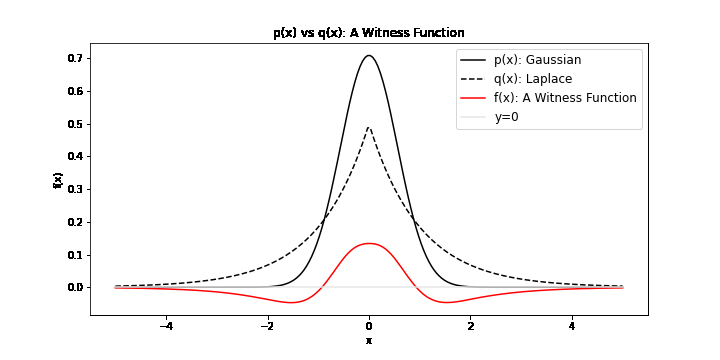
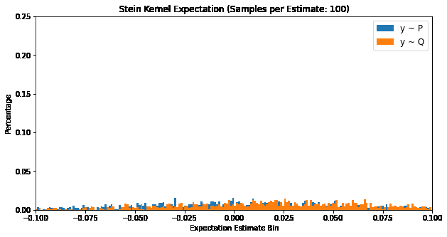

# The Kernel Stein Discrepancy

## Motivations

Stein discrepancies (SDs) calculate a statistical divergence between a known density $$\mathbb{P}$$ and samples from an unknown distribution $$\mathbb{Q}$$. We can express Stein discrepancies as [[1]](#1):

$$\operatorname{SD}(\mathbb{P}, \mathbb{Q})$$

Under mild regularity conditons, the Stein discsrepancy has the statistical divergence properties [[2]](#2):

$$\operatorname{SD}(\mathbb{P}, \mathbb{Q}) = 0 \Leftrightarrow \mathbb{P} = \mathbb{Q}$$

and 

$$\operatorname{SD}(\mathbb{P}, \mathbb{Q}) \geq 0$$

One common form of SDs is the Langevin Kernel Stein discrepancy (KSD), which we will describe in some detail. The KSD calculates the divergence of an unnormalised density function with samples from an unknown distribution. In many applications of statistics and machine learning, the existence of a statistical quantity with these properties is very useful. In many cases, using an unnormalised density can mitigate model intractability. We also don't require assumptions on our unknown distribution, calculating the divergence directly from the samples. Stein discrepancies have been the source of many important research directions including the evaluation of sampling techniques and testing goodness of fit. 

We will first introduce the formulation of Stein disrepancies through the lens of integral probability metrics (IPMs). Afterwards, we will go into some details of the KSD. 

## Integral Probability Metrics (IPMs): A Quick Review

<!-- A probabily metric must satisfy the properties:

(i) $$d(\mathbb{P}_1, \mathbb{P}_2) = 0 \leftrightarrow P_1 = P2$$

(ii) $$d(\mathbb{P}_1, \mathbb{P}_2) = d(\mathbb{P}_2, \mathbb{P}_1)$$

(iii) $$d(\mathbb{P}_1, \mathbb{P}_3) \leq d(\mathbb{P}_1, \mathbb{P}_2)+d(\mathbb{P}_2, \mathbb{P}_3)$$ -->

The IPM is defined as [[3]](#3):

$$\operatorname{IPM}_\mathcal{F} = \sup_{f\in \mathcal{F}} \| \mathbb{E}_{x \sim \mathbb{P}}[f(x)] - \mathbb{E}_{y \sim \mathbb{Q}}[f(y)] \|$$

It is a comparison of two distribution under the transformation of some $$f$$ in $$\mathcal{F}$$. In particular, we search for $$f^*$$, called the witness function, a transformation that *maximimally* exposes the differences of $$x \sim \mathbb{P}$$ and $$y \sim \mathbb{Q}$$. We can visualise possible witness functions when $$\mathbb{P}$$ is Gaussian and $$\mathbb{Q}$$ follows a Laplace distribution:

<figure class="image" align="center">
  
  <figcaption> Notice that when f(x)=0,  p(x) = q(x). Moreover, when p(x) > q(x), f(x) > 0 and the same vice versa. This increases the quantity in the absolute value and ensures that the IPM is non-zero, indicating that the two distributons are different.
  </figcaption> 
</figure>

To find a meaningful $$f^*$$, $$\mathcal{F}$$ must be a large set of functions to ensure that the IPM is a metric. As you may be familiar with divergences (i.e. the Kullback Leiber Divergence), a metric is a divergence with the additional properties of symmetry and the triangle inequality. For example, if we chose $$\mathcal{F}: \{f(x) = 0\}$$, then $$\mathbb{E}_{x \sim \mathbb{P}}[f(x)] - \mathbb{E}_{y \sim \mathbb{Q}}[f(y)]$$ would always be zero. This would not be a metric. Another choice of $$\mathcal{F}$$ is $$\mathcal{C}_b(\mathcal{X})$$, the set of bounded continuous functions. This is a large enough set to ensure that the IPM is a metric, though it should be noted that the supremum in this case is not easily computable. There are many other choices of $$\mathcal{F}$$ that can formulate valid IPMs.

<!-- ## The Maximum Mean Discrepancy (MMD): A Quick Review

The supremum in the IPM is over $$F$$, the space of *all* possible functions. This can be impractical to evaluate and we often limit our function space to the unit ball of a reproducing kernel Hilbert space (RKHS). This restriction on the IPM constructs the Maximum Mean Discrepancy (MMD):

$$\operatorname{MMD} = \sup_{\|f\|_{\operatorname{RKHS}} \leq 1 } \{ \mathbb{E}_{x \sim \mathbb{P}}[f(x)] - \mathbb{E}_{y \sim \mathbb{Q}}[f(y)] \}$$

To ensure $$\operatorname{MMD} = 0 \Leftrightarrow \mathbb{P} = \mathbb{Q}$$, the kernel must be *characteristic*. This means that the kernel uniquely maps our density function into the RKHS. Characterstic kernels often involve an exponential function, such as the Gaussian Kernel, $$k(x, y) = \exp(-\sigma\|x-y\|_2^2)$$ where the exponential acts as a fourier transform on the probability distribution. The uniqueness property is acheived by incorporating all moments of the distribution into the mapping. Witness functions that are able to discriminate pointwise between samples of $$\mathbb{P}$$ and $$\mathbb{Q}$$ also need to be avoided (i.e. a function with a positive impulse at each $$\mathbb{P}$$ sample and a negative impulse at each $$\mathbb{Q}$$ sample). The unit ball restriction $$\|f\| \leq 1$$, applies a decay on higher frequencies, ensuring the smoothness of $$f$$.

Given $$k(\cdot, \cdot)$$, the reproducing kernel associated with our RKHS, it can be shown that:

$$\operatorname{MMD}^2 =  \mathbb{E}_{X, \tilde{X} \sim \mathbb{P}}[k(X,\tilde{X})]-2\mathbb{E}_{X \sim \mathbb{P},Y \sim \mathbb{Q}}[k(X,Y)]+\mathbb{E}_{Y, \tilde{Y} \sim \mathbb{Q}}[k(Y,\tilde{Y})]$$ 

where the derivation can be found in the Appendix. Usually the RKHS is defined by our choice of reproducing kernel.

An unbiased estimate of the MMD:

$$\hat{\operatorname{MMD}}^2 = \frac{1}{m(m-1)}\sum_{i=1}^{m}\sum_{j\neq i}^{m}k(x_i, x_j)+\frac{1}{n(n-1)}\sum_{i=1}^{n}\sum_{j\neq i}^{n}k(y_i, y_j)-\frac{2}{mn}\sum_{i=1}^{m}\sum_{j=1}^{n}k(x_i, y_j)$$

### MNIST Example

The MMD only requires samples from $$\mathbb{P}$$ and $$\mathbb{Q}$$, making no assumptions about their underlying distributions. This is useful when we don't have strong intuitions about the data generating process. An example is the MNIST dataset, where we can quantify the discrepancy between digits directly from the image samples. Moreover, the kernel chosen for the MMD defines the RKHS from which we acquire our witness function. Visualising the kernel function and the corresponding heatmap of MMD values between digit samples:

<figure class="image" align="center">
  
</figure>

Samples from the same digit have lower MMDs (the diagonal) and we have higher MMDs for digits that are not as similar, such as zero and one. With different kernel parameters, we can see that if a poor kernel is chosen, the corresponding RKHS might provide a poor function space for discriminating $$\mathbb{P}$$ and $$\mathbb{Q}$$. This emphasises the importance of kernel selection for kernel-based discrepancies. -->

## Stein Discrepancies

<!-- The MNIST example showed that when $$\mathbb{P}$$ and $$\mathbb{Q}$$ are unknown, the MMD is very effective. However, we often have samples from an unknown $$\mathbb{Q}$$ that we want to compare to a known $$\mathbb{P}$$. In this case, the MMD would have us sampling both $$\mathbb{P}$$ and $$\mathbb{Q}$$, a pretty inefficient approach. The Kernel Stein Discrepancy (KSD) solves this problem by incorporating the density function of $$\mathbb{P}$$ into the discrepancy calculation.  -->
The KSD quantifies the descrepancy between a known density $$\mathbb{P}$$ and samples from an unknown distribution $$\mathbb{Q}$$. It does this by modifying $$f$$ from the IPM with a Stein Operator satisfying the Stein Identity.

### The Stein Identity

Suppose we want to find an operator $$\mathcal{A_\mathbb{P}}$$ such that [[1]](#1):

$$\mathbb{E}_{x \sim \mathbb{P}}[(\mathcal{A}f)(X)] = 0,  \forall f \in \mathcal{F} \Leftrightarrow X \sim \mathbb{P}$$ 

This is known as the Stein Identity. Any operator $$\mathcal{A}$$ that satisfies the Stein identity is called a Stein operator. Using our IPM equation and applying a Stein operator to $$f$$, the first term evaluates to zero using the Stein Identity and we get the Stein discrepancy [[1]](#1):

$$\operatorname{SD}_\mathcal{F} = \sup_{f\in \mathcal{F}} \|\mathbb{E}_{y \sim \mathbb{Q}}[(\mathcal{A}f)(y)] \|$$

Notice that only when $$\mathbb{P} = \mathbb{Q}$$, the Stein discrepancy evaluates to zero, as we expect. For the Stein discrepancy, the set $$\mathcal{F}$$ is also referred to as the Stein set. Although we are trying to calculate the discrepancy between $$\mathbb{P}$$ and $$\mathbb{Q}$$, you may notice that the Stein discrepancy doesn't seem to explicitly involve $$\mathbb{P}$$. It is actually incorporated in our Stein operator $$\mathcal{A}$$.

### The Langevin Stein Operator

Understanding Stein operators that satisfy the Stein equation remains an open problem, but there have been many formulations of $$\mathcal{A}$$. One is the Langevin Stein operator [[4]](#4) (proof in [[A1]](#A1)): 

$$(\mathcal{A}f)(x) := \dfrac{1}{p(x)} \dfrac{d}{dx}(f(x)p(x))$$

where $$p(x)$$ is the density of $$\mathbb{P}$$. In machine learning, this is often called *the* Stein operator. As we expect, $$\mathbb{P}$$ is still present in our Stein discrepancy, but embedded into our Stein operator. We will denote the Stein operator $$\mathcal{A_{\mathbb{P}}}$$ to indicate this explicitly: 

$$\operatorname{SD}_\mathcal{F} = \sup_{f \in \mathcal{F}} \|\mathbb{E}_{y \sim \mathbb{Q}}[(\mathcal{A_{\mathbb{P}}}f)(y)] \|$$

From the definition of the Langevin Stein operator, we can rewrite (derivation in [[A2]](#A2)):

$$(\mathcal{A_{\mathbb{P}}}f)(x) = \langle \nabla_x \log p(x), f(x) \rangle_H + \nabla_x f(x)$$

Now that we have a concrete example of a Stein operator, let's discuss methods of calculating $$(\mathcal{A_{\mathbb{P}}}f)$$ on $$\mathbb{Q}$$ samples.

### Langevin Stein Kernels

By choosing the Stein set $$\mathcal{F}$$ as the unit-ball of a reproducing kernel Hilbert space (RKHS), we can take advantage of kernel methods to compute the Langevin Stein discrepancy. 

A unique kernel is defined by a chosen RKHS, having the dot product:

$$k(x, y) = \langle f(x), f(y)\rangle_{\mathcal{RKHS}}$$

where $$f$$ is the set of functions restricted in the unit-ball, $$\|f\|_{\mathcal{RKHS}} \leq 1$$.

Applying our Langevin Stein operator:

$$k_{\mathbb{P}}(x, y) = \langle (\mathcal{A}_\mathbb{P} f)(x), (\mathcal{A}_\mathbb{P} f)(y)\rangle_{\mathcal{H}}$$

Deriving the corresponding Langevin Stein kernel ([[A3]](#A3) for full derivation):

$$k_{\mathbb{P}}(x, y) = \nabla_y \log p(y)^T\nabla_x \log p(x) k(x, y) + \nabla_y \log p(y)^T\nabla_x k(x, y) + \nabla_x \log p(x)^T \nabla_y k(x, y) +  Tr(\nabla_x \nabla_y k(x,y))$$

The Langevin Stein kernel is a modification of a kernel with $$p(x)$$, the density of $$\mathbb{P}$$.

### Numerical Convergence

We can verify our Stein identity using the Langevin Stein Kernel:

$$\mathbb{E}_{X \sim \mathbb{P}}[k_{\mathbb{P}}(x, X)] = 0 \Leftrightarrow X \sim \mathbb{P}$$

where $$x \in \mathbb{R}^d$$, by plotting the distribution of expectations of samples of $$k_{\mathbb{P}}(X, x)$$. The below plot compares $$X \sim \mathbb{P}$$ and $$X \sim \mathbb{Q}$$, where $$\mathbb{P}$$ is a Gaussian distribution and $$\mathbb{Q}$$ is a Laplace distribution. 

<figure class="image" align="center">
  
  <figcaption> For P (matching the density in the Stein kernel), the histogram of the kernel expectation centers around zero, while the histogram for Q has a non-zero mean, as we expect. Moreover, the effect of the law of large numbers shows how the spread of the histogram narrow as the sample size increases. 
  </figcaption> 
</figure>

## The Langevin Kernel Stein Discrepancy

We have essentially arrived at the formulation of the Langevin KSD. It is defined as [[1]](#1):

$$\operatorname{KSD}^2 = \mathbb{E}_{X, \tilde{X} \sim \mathbb{Q}}[k_{\mathbb{P}}(X, \tilde{X})]$$

where $$k_{\mathbb{P}}$$ is the Stein kernel.

An unbiased estimate [[5]](#5):

$$\hat{\operatorname{KSD}}^2 = \frac{1}{m(m-1)}\sum_{i=1}^{m}\sum_{j\neq i}^{m}k_{\mathbb{P}}(x_i, x_j)$$

<!-- ### $$\operatorname{MMD} \Rightarrow \operatorname{KSD}$$ 

We derived the KSD from the MMD formulation, cancelling terms using the Stein identity. We can in some ways view the KSD is an instance of the MMD using a Stein kernel. If we computed the MMD with a Stein kernel, we can see its convergence to the KSD via the law of large numbers, $$\mathbb{E}_{X \sim \mathbb{P}}[k_{\mathbb{P}}(X, \tilde{X})] \rightarrow 0$$ and $$\mathbb{E}_{X \sim \mathbb{P}, Y \sim \mathbb{Q}}[k_{\mathbb{P}}(X, Y)] \rightarrow 0$$.

<figure class="image" align="center">
  
  <figcaption> </figcaption>
</figure> -->

### Visualising Stein Kernels

Because of their complex formulation, it can be difficult to have an intuitive understanding of Stein kernels. Visualisations may help build an understanding of what's going on. The resulting Stein kernel can be quite complex, but we can see how they are constructed with a series of simpler components. Recall the Stein kernel:

$$k_{\mathbb{P}}(x, y) = \nabla_y \log p(y)^T\nabla_x \log p(x) k(x, y) + \nabla_y \log p(y)^T\nabla_x k(x, y) + \nabla_x \log p(x)^T \nabla_y k(x, y) +  Tr(\nabla_x \nabla_y k(x,y))$$

Below, we first plot the distribution and base kernel $$k(x,y=y')$$. This is followed by a breakdown of the four terms in the Stein kernel, each calculated through the product of a distribution component and a kernel component. Finally, the resulting Stein kernel is visualised as the sum of these four terms. 

<!-- Here is breakdown of a Stein kernel with a Laplace distribution and Gaussian base kernel: -->

<!-- <figure class="image" align="center">
  
</figure> -->

<!-- Another breakdown of a Stein kernel with a Cauchy distribution and inverse multi-quadratic base kernel: -->

Here is breakdown of a Stein kernel with a Cauchy distribution and inverse multi-quadratic base kernel:

<figure class="image" align="center">
  
</figure>

## Applications of the KSD

### Sampling Techniques

For many complex distributions, sampling techniques (i.e. MCMC) are important tools. Through the development of these samplers, we need to ensure that they generate data points that are genuinely representative of the underlying distribution. The KSD can help evaluate the quality of a sampler [[4]](#4). 

<!-- In addition to evaluating sampler quality, the KSD can also be used "correct" the samples of a biased sampler. This correction can be done by applying weight to each sample and minimising the KSD with respect to these sample weights. We can therefore continue to use a biased sampler that might be more computationally efficient by simply reweighting its samples with the KSD. -->

### Goodness of Fit
The goodness of fit of a statistical model is fundamental to hypothesis testing in statistics. It involves quantifying the discrepancy between samples $$D = \{x_i\}_{i=1}^{N}$$ and a statistical model $$\mathbb{P}_\theta$$. We can compute the KSD:

$$\operatorname{KSD}_{\mathbb{P}_\theta}(\{x_i\}_{i=1}^{N})$$

which can be used for hypothesis testing [[5]](#5).

<!-- This is a powerful tool that we can build on through estimation of $$\theta$$. We can estimate the parameters $$\theta$$ from a distribution family $$\mathbb{P}_{\theta}, \theta \in \Theta$$:

$$\arg \min_{\theta \in \Theta} \operatorname{KSD}_{\mathbb{P}_\theta}(\{x_i\}_{i=1}^{N})$$

where $$x_i \sim \mathbb{Q}$$, the unknown distribution that we want to estimate. -->

## Some Last Thoughts

Hopefully this was a helpful introduction to the KSD and Stein kernels! The visualisations in this blog were generated using [my github repository](https://github.com/jswu18/distribution-discrepancies) for distribution discrepancies. Feel free to check it out! 

Finally, I'd like to thank [Oscar Key](https://oscarkey.github.io) for helping me these past few months as I tried to wrap my head around most of these concepts. Thank you for your patience and constant feedback!

## References
<a id="1">[1]</a> 
Anastasiou, A., Barp, A., Briol, F. X., Ebner, B., Gaunt, R. E., Ghaderinezhad, F., ... & Swan, Y. (2021). Stein's Method Meets Statistics: A Review of Some Recent Developments. arXiv preprint arXiv:2105.03481.

<a id="2">[2]</a> 
Barp, A., Briol, F. X., Duncan, A., Girolami, M., & Mackey, L. (2019). Minimum stein discrepancy estimators. Advances in Neural Information Processing Systems, 32.

<a id="3">[3]</a> 
Müller, A. (1997). Integral probability metrics and their generating classes of functions. Advances in Applied Probability, 29(2), 429-443.
Chicago	

<a id="4">[4]</a> 
Gorham, J., & Mackey, L. (2017, July). Measuring sample quality with kernels. In International Conference on Machine Learning (pp. 1292-1301). PMLR.

<a id="5">[5]</a> 
Liu, Q., Lee, J., & Jordan, M. (2016, June). A kernelized Stein discrepancy for goodness-of-fit tests. In International conference on machine learning (pp. 276-284). PMLR.
Chicago	

## Appendices 
<!-- ### MMD Derivation

Starting with the IPM definition:

$$\operatorname{IPM} = \sup_{f\in F} \{ \int f(x) d \mathbb{P}(x)-\int f(y) d \mathbb{Q}(y) \}$$

For the MMD we choose $$F:= \{\|f\|_H \leq 1 \}$$:

$$\operatorname{MMD}^2 = \left[ \sup_{\|f\|\leq 1} \{ \int f(x) d \mathbb{P}(x)-\int f(y) d \mathbb{Q}(y) \} \right]^2$$

Given that $$\mathbb{E}_{x \sim \mathbb{P}}[f(x)] = \langle f, \mu_{\mathbb{P}}\rangle_H$$ and $$\mathbb{E}_{x \sim \mathbb{P}}[f(x)] := \int f(x)d\mathbb{P}(x)$$, we can substitute:

$$\operatorname{MMD}^2 = \left[ \sup_{\|f\|\leq 1} \{ \langle f, \mu_{\mathbb{P}}\rangle_H-\langle f, \mu_{\mathbb{Q}}\rangle_H \} \right]^2$$

and by linearity,

$$\operatorname{MMD}^2 = \left[ \sup_{\|f\|\leq 1} \{ \langle f, \mu_{\mathbb{P}}-\mu_{\mathbb{Q}}\rangle_H \} \right]^2$$

Claim:

$$\sup\{\langle v, w\rangle: w \in V, \|w\| \leq 1\} = \sup\{\langle v, w\rangle: w \in V, \|w\| = 1\}$$

Consider $$w' = \alpha w$$ where $$\|w\|=1$$ and $$0 \leq \alpha \leq 1$$:

Then $$\|w'\| \leq 1$$ and 

$$\langle v, w'\rangle = \langle v, \alpha w\rangle = \alpha \langle v, w\rangle \leq \langle v, w\rangle$$

Thus $$\langle v, w\rangle$$ for $$\|w\| \leq 1$$ is maximised when $$\|w\|=1$$ and the supremum of $$\langle v, w\rangle$$ for $$\|w\| \leq 1$$ will always have $$\|w\| = 1$$.

Back to our MMD derivation, with the result above, we can replace $$\|f\| \leq 1$$ with $$\|f\|=1$$:

$$\operatorname{MMD}^2 = \left[ \sup_{\|f\|= 1} \{ \langle f, \mu_{\mathbb{P}}-\mu_{\mathbb{Q}}\rangle_H \} \right]^2$$

We can also prove that $$\|v\| = \sup_{\|w\|=1} \{ \langle v, w\rangle \}$$:

($$\leq$$):

Let $$w' := \frac{v}{\|v\|}$$ and knowing $$\|v\| = \sqrt{\langle v, w\rangle}$$:

$$\|v\|^2 = \langle v, v\rangle = \|v\|\langle v, \frac{v}{\|v\|}\rangle = \|v\|\langle v, w'\rangle$$

Moreover,

$$\|v\|^2 \leq \|v\| \sup \{\langle v, w\rangle : w \in V, \|w\|=1\}$$

Thus,

$$\|v\|^2 \leq \sup \{\langle v, w\rangle : w \in V, \|w\|=1\}$$

($$\geq$$ ):

From the Cauchy-Schqarz inequality:

$$\left\| v \right\| \left\| w \right\| \geq |\langle v, w\rangle|$$

Given that $$\|w\|=1$$:

$$\|v\| \geq |\langle v, w\rangle|$$

Thus,

$$\|v\|^2 \geq \sup \{\langle v, w\rangle : w \in V, \|w\|=1\}$$

Combining the above:

$$\|v\|^2 = \sup \{\langle v, w\rangle : w \in V, \|w\|=1\}$$

Using this result for our MMD expression:

$$\operatorname{MMD}^2 = \|\mu_{\mathbb{P}}-\mu_{\mathbb{Q}}\|^2_H$$

Expanding,

$$\operatorname{MMD}^2 = \langle \mu_{\mathbb{P}}-\mu_{\mathbb{Q}}, \mu_{\mathbb{P}}-\mu_{\mathbb{Q}}\rangle = \langle \mu_{\mathbb{P}}, \mu_{\mathbb{P}}\rangle - 2\operatorname{Re}(\langle \mu_{\mathbb{P}}, \mu_{\mathbb{Q}}\rangle) + \langle \mu_{\mathbb{Q}}, \mu_{\mathbb{Q}}\rangle$$

Simplifying,

$$\operatorname{MMD}^2 = \|\mu_{\mathbb{P}}\|^2 - 2|\langle \mu_{\mathbb{P}}, \mu_{\mathbb{Q}} \rangle|_H + \|\mu_{\mathbb{Q}}\|^2_H$$

Knowing that $$\|\mu_{\mathbb{P}}\|^2_H = \langle \mathbb{E}[k(\cdot, X)], \mathbb{E}[k(\cdot, \tilde{X})]\rangle = \mathbb{E}[k(X, \tilde{X})]$$ and $$\langle \mu_{\mathbb{P}}, \mu_{\mathbb{P}} \rangle_H = \langle\mathbb{E}[k(\cdot, X)], \mathbb{E}[k(\cdot, Y)]\rangle = \mathbb{E}[k(X, Y)]$$, we can substitute and achieve our desired result:

$$\operatorname{MMD}^2 =  \mathbb{E}_{X, \tilde{X} \sim \mathbb{P}}[k(X,\tilde{X})]-2\mathbb{E}_{X \sim \mathbb{P},Y \sim \mathbb{Q}}[k(X,Y)]+\mathbb{E}_{Y, \tilde{Y} \sim \mathbb{Q}}[k(Y,\tilde{Y})]$$ -->

### <a id="A1"> Appendix 1: Stein Identity Proof for the Langevin Stein Kernel </a> 

Inserting into the Stein identity, we can check that it holds:

$$\mathbb{E}_{x \sim \mathbb{P}}[\dfrac{1}{p(x)}\dfrac{d}{dx}(f(x)p(x))]$$

From the definition of the expectation:

$$\int p(x) \dfrac{1}{p(x)}\dfrac{d}{dx}(f(x)p(x))dx$$

Cancelling terms:

$$\int \dfrac{d}{dx}(f(x)p(x))dx$$

We end up with the result:

$$[f(x)p(x)]_{-\infty}^{\infty}$$

Assuming that as $$x \rightarrow \pm\infty$$ the quantities $$p(x) \rightarrow 0$$ and $$f(x) \rightarrow 0$$, we have satisfied the Stein Identity.

### <a id="A2">Appendix 2: Langevin Stein Operator Derivation</a>

Unpacking the Langevin Stein operator: 

$$\dfrac{1}{p(x)} \dfrac{d}{dx}(f(x)p(x)) = \dfrac{1}{p(x)}(p(x)\dfrac{d}{dx}f(x)+ f(x)\dfrac{d}{dx}p(x)$$

Expanding:

$$\dfrac{d}{dx}f(x)+ f(x)\dfrac{1}{p(x)}\dfrac{d}{dx}p(x)$$

Knowing that $$\dfrac{d}{dx} \log(f(x)) = \dfrac{f'(x)}{f(x)}$$:

$$\dfrac{d}{dx}(f(x))+ f(x)\dfrac{d}{dx}\log p(x)$$

Defining the second term as a dot product, we have our desired formulation of the Langevin Stein operator:

$$(\mathcal{A}f)(x) = \langle \nabla_x \log p(x), f(x) \rangle_H + \nabla_x f(x)$$

### <a id="A3">Appendix 3: Langevin Stein Kernel Derivation</a>

Starting with:

$$k_{\mathbb{P}}(x, y) = \langle (\mathcal{A}_\mathbb{P} f)(x), (\mathcal{A}_\mathbb{P} f)(y)\rangle_H$$

From linearity:

$$k_{\mathbb{P}}(x, y) = \mathcal{A}_\mathbb{P}^y \mathcal{A}_\mathbb{P}^x \langle f(x),f(y)\rangle_H$$

$$k_{\mathbb{P}}(x, y) = \mathcal{A}_\mathbb{P}^y \mathcal{A}_\mathbb{P}^x k(x, y)$$

where $$\mathcal{A}_\mathbb{P}^x$$ indicates $$\mathcal{A}_\mathbb{P}$$ applied on $$x$$.

Applying $$\mathcal{A}_\mathbb{P}^x$$:

$$k_{\mathbb{P}}(x, y) = \mathcal{A}_\mathbb{P}^y (\nabla_x \log p(x) k(x, y) + \nabla_x k(x, y))$$

Note that $$\nabla_x k(x, y) = \langle \nabla_x f(x), f(y) \rangle_H$$:

$$k_{\mathbb{P}}(x, y) = \mathcal{A}_\mathbb{P}^y (\nabla_x \log p(x) k(x, y) + \langle \nabla_x f(x), f(y) \rangle_H)$$

Applying $$\mathcal{A}_\mathbb{P}^y$$:

$$k_{\mathbb{P}}(x, y) = \nabla_y \log p(y)^T\nabla_x \log p(x) k(x, y) + \nabla_y \log p(y)^T\nabla_x k(x, y) + \nabla_x \log p(x)^T \nabla_y k(x, y) +  \langle \nabla_x f(x), \nabla_y f(y)\rangle_H$$

We can rewrite $$\langle \nabla_x f(x), \nabla_y f(y)\rangle_H = \sum_i \frac{\partial k(x,y)}{\partial x_i \partial y_i} = Tr(\nabla_x \nabla_y k(x,y))$$. 

We arrive at the Langevin Stein Kernel:

$$k_{\mathbb{P}}(x, y) = \nabla_y \log p(y)^T\nabla_x \log p(x) k(x, y) + \nabla_y \log p(y)^T\nabla_x k(x, y) + \nabla_x \log p(x)^T \nabla_y k(x, y) +  Tr(\nabla_x \nabla_y k(x,y))$$
